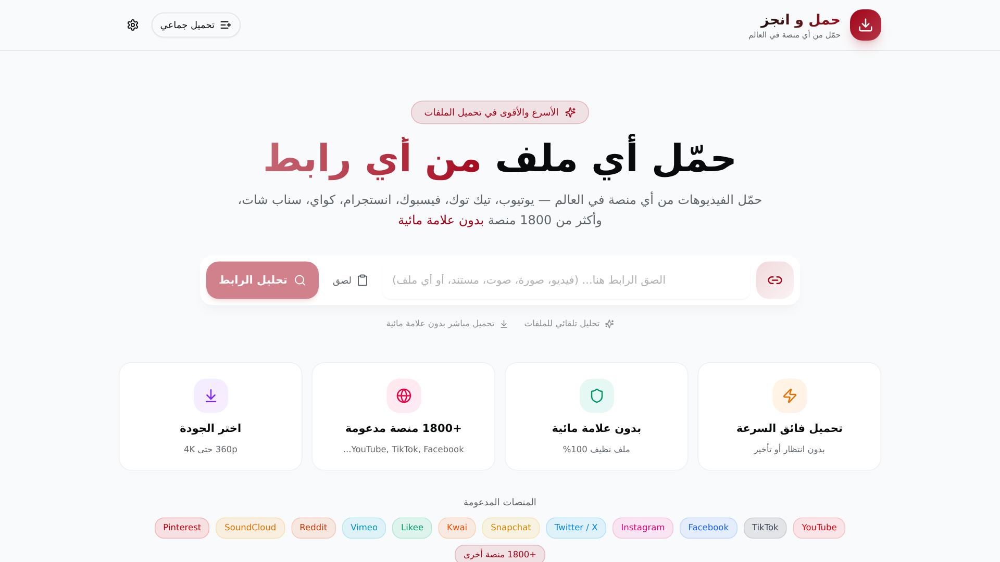

<div align="center">

# ⬇️ حمّل وانجز | Hammel w Engez

## 📸 لقطات الشاشة | Screenshots



### أداة تحميل ذكية من أي رابط — بضغطة واحدة
### Smart universal download tool — paste any URL and download instantly

[](https://hammel-w-engez.vercel.app)
[](https://github.com/ziadamr45/Hammel-w-Engez)

</div>

---

## 📖 نبذة

<div dir="rtl">

**حمّل وانجز** هو تطبيق ويب متكامل لتحميل أي ملف من أي رابط بسهولة وسرعة. سواء كان فيديو، صوت، صورة، أو أي ملف آخر — فقط الصق الرابط وحمّل فورًا. التطبيق يدعم التحميل المتعدد (Batch Download) ويحلل الرابط تلقائيًا ليظهر لك معلومات الملف قبل التحميل.

صُمم التطبيق ليكون سريع الاستجابة، آمن، وسهل الاستخدام مع واجهة عربية أنيقة تدعم الوضع الداكن والفاتح.

</div>

## ✨ المميزات

| الميزة | الوصف |
|--------|-------|
| 📥 تحميل من أي رابط | حمّل أي ملف من أي رابط |
| 🔄 تحميل متعدد دفعة واحدة | حمّل عدة ملفات في نفس الوقت |
| 🔍 تحليل تلقائي للرابط | معلومات الملف قبل التحميل |
| 📜 سجل التحميلات | تابع كل تحميلاتك السابقة |
| ⚙️ إعدادات مخصصة | خصّص تجربة التحميل |
| 🌙 وضع داكن/فاتح | اختر المظهر المناسب لك |
| 📱 تصميم متجاوب | يعمل على جميع الأجهزة |
| 🔒 آمن ومحمي | تحميل آمن ومشفر |

## 🛠️ التقنيات

| التقنية | الاستخدام |
|---------|-----------|
|  | إطار العمل الكامل |
|  | تطوير آمن بالأنواع |
|  | التصميم |
|  | مكونات واجهة المستخدم |
|  | ORM لقاعدة البيانات |
|  | النشر والاستضافة |
|  | الحركات والأنيميشن |

## 🚀 التشغيل

### المتطلبات

- Node.js 18+ أو Bun
- npm أو yarn أو bun

### التثبيت

```bash
# استنساخ المستودع
git clone https://github.com/ziadamr45/Hammel-w-Engez.git
cd Hammel-w-Engez

# تثبيت التبعيات
npm install
# أو
bun install

# إعداد متغيرات البيئة
cp .env.example .env
# عدّل ملف .env بالإعدادات الخاصة بك

# تشغيل تهجيرات قاعدة البيانات
npx prisma migrate dev

# تشغيل خادم التطوير
npm run dev
```

التطبيق سيعمل على `http://localhost:3000`

## 📁 هيكل المشروع

```
Hammel-w-Engez/
├── src/
│   ├── app/              # صفحات Next.js ومسارات API
│   ├── components/       # مكونات React
│   │   ├── download/     # مكونات التحميل
│   │   └── ui/           # مكونات واجهة مستخدم قابلة لإعادة الاستخدام
│   ├── hooks/            # خطافات React المخصصة
│   ├── lib/              # أدوات ومساعدات
│   └── store/            # إدارة الحالة
├── prisma/               # مخطط قاعدة البيانات والتهجيرات
├── public/               # الملفات الثابتة
└── package.json
```

## 🤝 المساهمة

المساهمات مرحب بها! لا تتردد في فتح مشاكل أو إرسال طلبات سحب.

---

<div align="center">

Ziad Amr

</div>

---


### 👨‍💻 المطور

**زياد عمرو (Ziad Amr)**

- 🌐 الموقع الشخصي: [ziadamrme.vercel.app](https://ziadamrme.vercel.app)
- 💼 GitHub: [ziadamr45](https://github.com/ziadamr45)
- 📘 Facebook: [ziad7mr](https://www.facebook.com/ziad7mr)
- 💬 Telegram: [@ziadamr](https://t.me/ziadamr)
- 📸 Instagram: [ziadamr455](https://www.instagram.com/ziadamr455/)
- 🧵 Threads: [@ziadamr455](https://www.threads.com/@ziadamr455)
- 🐦 X: [@ziad90216](https://x.com/ziad90216)
- 🎥 YouTube: [@alhayat_ala_eltarek](https://youtube.com/@alhayat_ala_eltarek?si=pcsc_31Kcv3Jym14)
- 💼 LinkedIn: [ziad-amr](https://www.linkedin.com/in/ziad-amr-44633a411)
- 📧 Email: ziad90216@gmail.com

---

## English

**Hammel w Engez** is a full-featured web application for downloading any file from any URL with a single click. Whether it's a video, audio, image, or any other file — just paste the link and download instantly. The app supports batch downloading and automatically analyzes the URL to show file information before downloading.

Built with a focus on speed, security, and ease of use with a beautiful Arabic-first UI supporting dark and light modes.

### Features

| Feature | Description |
|---------|-------------|
| 📥 Download from any URL | Download any file from any link |
| 🔄 Batch download support | Download multiple files at once |
| 🔍 Automatic URL analysis | File information before downloading |
| 📜 Download history | Track all your past downloads |
| ⚙️ Customizable settings | Customize your download experience |
| 🌙 Dark/Light mode | Choose your preferred theme |
| 📱 Responsive design | Works on all devices |
| 🔒 Secure & safe | Safe and encrypted downloads |

### Tech Stack

| Technology | Purpose |
|------------|---------|
|  | Fullstack Framework |
|  | Type-safe Development |
|  | Styling |
|  | UI Components |
|  | Database ORM |
|  | Deployment |
|  | Animations |

### Getting Started

#### Prerequisites

- Node.js 18+ or Bun
- npm, yarn, or bun

#### Installation

```bash
# Clone the repository
git clone https://github.com/ziadamr45/Hammel-w-Engez.git
cd Hammel-w-Engez

# Install dependencies
npm install
# or
bun install

# Set up environment variables
cp .env.example .env
# Edit .env with your configuration

# Run database migrations
npx prisma migrate dev

# Start development server
npm run dev
```

The app will be available at `http://localhost:3000`

### Project Structure

```
Hammel-w-Engez/
├── src/
│   ├── app/              # Next.js pages & API routes
│   ├── components/       # React components
│   │   ├── download/     # Download-specific components
│   │   └── ui/           # Reusable UI components
│   ├── hooks/            # Custom React hooks
│   ├── lib/              # Utilities & helpers
│   └── store/            # State management
├── prisma/               # Database schema & migrations
├── public/               # Static assets
└── package.json
```

### Contributing

Contributions are welcome! Feel free to open issues or submit pull requests.

---

<div align="center">

Ziad Amr

</div>

### 👨‍💻 Developer

**Ziad Amr**

- 🌐 Portfolio: [ziadamrme.vercel.app](https://ziadamrme.vercel.app)
- 💼 GitHub: [ziadamr45](https://github.com/ziadamr45)
- 📘 Facebook: [ziad7mr](https://www.facebook.com/ziad7mr)
- 💬 Telegram: [@ziadamr](https://t.me/ziadamr)
- 📸 Instagram: [ziadamr455](https://www.instagram.com/ziadamr455/)
- 🧵 Threads: [@ziadamr455](https://www.threads.com/@ziadamr455)
- 🐦 X: [@ziad90216](https://x.com/ziad90216)
- 🎥 YouTube: [@alhayat_ala_eltarek](https://youtube.com/@alhayat_ala_eltarek?si=pcsc_31Kcv3Jym14)
- 💼 LinkedIn: [ziad-amr](https://www.linkedin.com/in/ziad-amr-44633a411)
- 📧 Email: ziad90216@gmail.com
